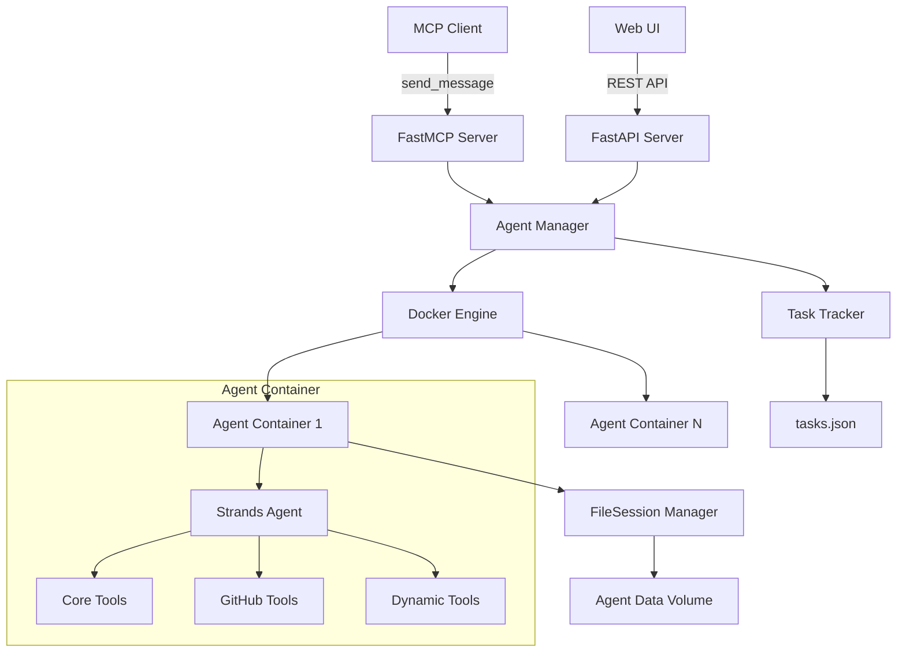

# Project Overview

Containerized Strands Agents is an MCP (Model Context Protocol) server that hosts isolated Strands AI agents in Docker containers. Each agent runs independently with its own workspace, persists conversation history across restarts, and can be managed through both MCP tools and a web interface. The project enables fire-and-forget agent communication with full session persistence and custom system prompts.

## Repository Structure

- **`src/containerized_strands_agents/`** – Core MCP server implementation with agent management
- **`docker/`** – Docker configuration and agent runner with Strands integration
- **`ui/`** – Web interface for agent management with real-time status updates
- **`scripts/`** – Build and deployment scripts for Docker image and server startup
- **`tests/`** – Comprehensive test suite including unit, integration, and end-to-end tests
- **`*.md`** – Feature documentation covering system prompts, dynamic lists, and stop functionality

## Build & Development Commands

```bash
# Basic installation
pip install -e .

# With all features (web UI and development tools)
pip install -e ".[webui,dev]"

# Build Docker image manually (optional - auto-built on first use)
./scripts/build_docker.sh

# Run MCP server
containerized-strands-agents
# or
python -m containerized_strands_agents.server

# Run web UI
containerized-strands-agents-webui
# or
python run_web_ui.py

# Run tests
python -m pytest tests/ -v

# Run specific test categories
python -m pytest tests/test_integration.py -v
python -m pytest tests/test_e2e.py -v
```

## Code Style & Conventions

- **Language**: Python 3.11+ with type hints throughout
- **Formatting**: Black-compatible with 100-character line length
- **Imports**: Standard library, third-party, then local imports
- **Docstrings**: Google style with Args/Returns sections
- **Async**: Use async/await for I/O operations, fire-and-forget for agent messaging
- **Error handling**: Structured responses with status/error fields
- **Logging**: Use module-level loggers with appropriate levels

## Architecture Notes



The system uses a containerized agent architecture where each agent runs in isolated Docker containers with mounted data volumes for persistence. The MCP server manages container lifecycle, while agents communicate via HTTP APIs. Session persistence is handled by Strands FileSessionManager, enabling conversation restoration across container restarts.

## Testing Strategy

- **Unit tests**: `tests/test_agent_manager.py`, `tests/test_*.py` - Mock Docker operations and test core logic
- **Integration tests**: `tests/test_integration.py` - Real Docker containers with temporary data directories
- **End-to-end tests**: `tests/test_e2e.py` - Full agent lifecycle including persistence and restart
- **Feature tests**: Dedicated test files for system prompts, dynamic lists, and file handling
- **CI requirements**: Docker must be available and running for integration/e2e tests

Run tests locally with Docker available, or skip Docker-dependent tests in CI environments.

## Security & Compliance

- **Container isolation**: Each agent runs in separate Docker containers with mounted volumes
- **AWS credentials**: Mounted read-only from `~/.aws/` directory into containers
- **GitHub access**: Fine-grained PAT tokens with repository-scoped permissions only
- **File system**: Agents work in `/data/workspace` with host volume persistence
- **Network isolation**: Containers use dedicated Docker network `agent-host-net`
- **Secrets**: Environment variables for tokens, never hardcoded in images
- **License**: MIT License with full usage permissions

## Agent Guardrails

- **Workspace restriction**: Agents must work in `/data/workspace` - other directories are ephemeral
- **Tool limitations**: Tools are baked into Docker image; runtime tool changes require image rebuild
- **Idle timeout**: Containers auto-stop after configurable timeout (default 12 hours)
- **Container ports**: Fixed internal port 8080, dynamic external port allocation
- **System prompts**: Only applied to new agents or those without existing sessions
- **File access**: Limited to mounted volumes and agent-specific data directories

## Extensibility Hooks

- **Environment variables**: `CONTAINERIZED_STRANDS_DATA_DIR`, `AGENT_HOST_IDLE_TIMEOUT`, `CONTAINERIZED_AGENTS_GITHUB_TOKEN`
- **Dynamic system prompts**: `CONTAINERIZED_AGENTS_SYSTEM_PROMPTS` for discoverable prompt files
- **Custom data directories**: Per-agent data storage for project-specific isolation
- **Tool loading**: `load_tool` function for runtime tool addition within containers
- **AWS profiles**: Per-agent AWS credential configuration
- **Docker volumes**: Automatic AWS credentials and custom directory mounting

## Further Reading

- **[DESIGN.md](DESIGN.md)** – Detailed architecture and communication flow
- **[CONFIGURATION.md](CONFIGURATION.md)** – Complete configuration matrix and limitations
- **[DYNAMIC_PROMPT_LIST_FEATURE.md](DYNAMIC_PROMPT_LIST_FEATURE.md)** – System prompt discovery and management
- **[SYSTEM_PROMPT_FILE_FEATURE.md](SYSTEM_PROMPT_FILE_FEATURE.md)** – File-based system prompt implementation
- **[STOP_AGENT_FEATURE.md](STOP_AGENT_FEATURE.md)** – Agent container management implementation
- **[ui/README.md](ui/README.md)** – Web interface documentation and API reference